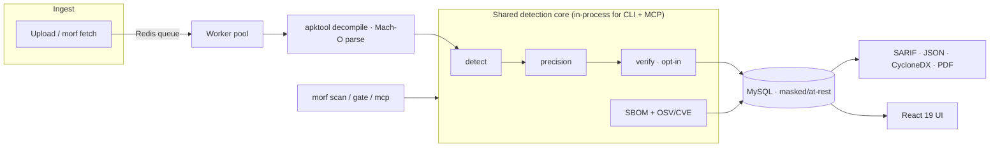

<div align="center">


# MORF · Mobile Reconnaissance Framework

**Find secrets in shipped mobile apps. Verify they're live. Gate the build.**

Dual **APK + IPA** artifact recon with a deterministic precision engine, opt-in live
verification, per-app **SBOM + CVE**, and **SARIF 2.1.0 / OWASP MASVS** output — as a
service, a CI-native CLI, and an MCP server for AI agents.

<br/>

[](https://github.com/amrudesh1/morf/actions/workflows/ci.yml)
[](LICENSE)
[](morf/go.mod)
[](frontend/)

[](docs/MASVS.md)
[](docs/MASVS.md)
[](docs/BENCHMARK.md)
[](https://www.blackhat.com/)

</div>

---

## Why MORF

Source scanners and repo secret-tools read your code. **MORF reads the binary you actually
ship** — the `.apk` and `.ipa` on the store — and answers three questions a plain regex
scanner can't:

| | Plain scanner | **MORF** |
|---|:---:|:---:|
| Scans the **shipped artifact** (APK **and** IPA) | ✗ | ✅ |
| **Verifies** a secret is live (read-only) | ✗ | ✅ |
| **Deterministic precision** engine (no LLM, no network) | ✗ | ✅ |
| **SARIF 2.1.0 + OWASP MASVS** for CI dashboards | partial | ✅ |
| Build **gate** on *new* secrets vs a baseline | ✗ | ✅ |
| Per-app **SBOM + CVE** correlation (CycloneDX 1.6) | ✗ | ✅ |

> A finding isn't just *"this looks like a Stripe key"* — it's *"this key is **active**,"*
> mapped to a MASVS control, masked in the report, and it only fails your pipeline if it's
> **new**.

---

## Table of Contents

- [Feature Matrix](#feature-matrix)
- [Quick Start](#quick-start)
- [CLI & CI](#cli--ci-morf-scan--morf-gate)
- [Detection & Precision](#detection--precision)
- [Verification](#verification-opt-in-read-only)
- [SBOM + CVE](#sbom--cve-per-app)
- [SARIF & OWASP MASVS](#sarif--owasp-masvs)
- [MCP Agent Server](#mcp-agent-server-morf-mcp)
- [Architecture](#architecture)
- [Security Posture](#security-posture)
- [Benchmark](#benchmark)
- [Documentation](#documentation)
- [Authors](#authors) · [License](#license) · [Acknowledgments](#acknowledgments)

---

## Feature Matrix

| | Capability |
|---|---|
| 📦 **Dual-platform recon** | Android `.apk` (apktool → smali + resources + native `.so`/Flutter/assets/config) and iOS `.ipa` (pure-Go Mach-O parse: Swift/Obj-C/C strings, frameworks, entitlements, URL schemes). |
| 🎯 **Precision engine** | `detect/precision.go` scores Shannon entropy + structure per candidate → `drop` / `info` / `keep`. Deterministic, no network, no LLM — cuts hundreds of raw hits to a clean handful. |
| 🔎 **280+ detectors** | One YAML pattern core compiled to a combined ripgrep regex, platform-scoped (`android`/`ios`/`any`), covering modern cloud/CI/SaaS/AI token families. |
| 🔴 **Live verification** | **24** read-only provider verifiers (GitHub, GitLab, Slack, Stripe, GCP, AWS SigV4 STS, OpenAI, Anthropic, Datadog, Square, Notion, …). Status: `active`/`inactive`/`unknown`/`unchecked`. Default **OFF**. |
| 🧾 **SBOM + CVE** | Evidence-based **CycloneDX 1.6** per scanned app (frameworks/dylibs/native libs/Firebase, PURL-mapped, lockfile version resolution) with opt-in **OSV/CVE** correlation into `vulnerabilities[]`. |
| 🛡️ **MASVS findings** | Secret findings **and** platform findings — exported-component / deeplink exposure and Firebase/GCP misconfig — tagged `MASVS-STORAGE / -CRYPTO / -NETWORK / -PLATFORM`. |
| 🚦 **CI gate** | `morf scan` / `morf gate` with policy exit codes and a build-diff gate that fails only on **new** secrets vs an accepted baseline. Reusable recipes for GitHub Actions, GitLab, Jenkins, CircleCI, pre-commit. |
| 🤖 **MCP agent server** | `morf mcp` exposes `scan_file`, `get_results`, `list_patterns`, `verify_secret`, `explain_finding` over stdio — every output masked, no DB/Redis/HTTP. |
| ⚙️ **Scalable service** | Redis reliable queue (DLQ + reaper) + worker pool, normalized MySQL (GORM), API-key auth + rate limiting, Prometheus/Grafana, OpenTelemetry tracing, S3/local storage, K8s/KEDA. |
| 🖥️ **Web UI** | React 19 + Vite + Tailwind: drag-and-drop upload, live scan stepper, findings by tier/platform, `/compare` diff, PDF export. |
| 🔐 **At-rest protection** | Values masked by default; optional AES-256-GCM at rest; stable identity via keyed-HMAC **fingerprint** (never plaintext). |

---

## Quick Start

MORF runs as a Docker Compose stack — **MySQL + Redis + Go backend + React frontend**:

```bash
git clone https://github.com/amrudesh1/morf && cd morf

# x86-64:
docker compose up -d --build

# Apple Silicon (arm64) — the backend must build native arm64:
docker compose -f docker-compose.yml -f docker-compose.local.yml up -d --build
```

| | URL |
|---|---|
| Web UI | http://localhost/ |
| API | http://localhost:9092/api |
| Health | http://localhost:9092/api/health |

Config lives in `.env` (copy [`.env.example`](.env.example)); every value has a local-dev
fallback, so `docker compose up` works out of the box — **override the credentials for any
real deployment.**

<details>
<summary><b>Run locally without Docker</b></summary>

```bash
cd morf && go build -o morf .
../scripts/fetch-tools.sh   # one-time: fetch apktool.jar for local APK scans
./morf scan ../path/to/app.ipa --sarif --out morf.sarif
```
iOS scanning is pure-Go (needs only `ripgrep`); APK scanning needs `java` + `apktool.jar`
(fetched by `scripts/fetch-tools.sh`, or use the Docker image which downloads it).
</details>

---

## CLI & CI (`morf scan` / `morf gate`)

The same scan → precision → verify pipeline the worker runs, built for CI.
[docs/CI.md](docs/CI.md) is the canonical command contract + reusable recipes.

```bash
# Emit SARIF, fail (exit 4) only on a live-verified secret:
morf scan app.apk --sarif --out morf.sarif --fail-on=verified --verify

# Report-only JSON, never fail the build:
morf scan app.ipa --format=json --fail-on=none

# Per-app SBOM with CVE correlation (opt-in network):
morf scan app.apk --format=cyclonedx-sbom --with-cve --out sbom.json

# Build-diff gate: fail only on NEW secrets vs an accepted baseline of fingerprints:
morf gate app.apk --baseline morf-baseline.json --fail-on=verified
morf gate app.apk --baseline morf-baseline.json --update-baseline   # accept current state

# Hermetic precision/recall benchmark:
morf benchmark
```

**Exit codes:** `0` pass · `4` policy hit (CI gates on this) · `1` operational error.
**`--fail-on`:** `verified` · `keep` · `any` · `none`. All SARIF/JSON values are masked.

<details>
<summary><b>GitHub Actions (gate-then-upload)</b></summary>

```yaml
- uses: amrudesh1/morf/.github/actions/morf-scan@main
  with:
    artifact: app.apk
    fail-on: verified
    verify: "true"
# scans → uploads SARIF to code scanning → gates the build on the captured exit code
```
</details>

---

## Detection & Precision

One shared **detection core** (`detect/`) compiles 280+ platform-scoped YAML patterns into
a single ripgrep pass over both platforms — including native `.so`, Flutter/RN bundles,
`assets/`, `resources.arsc`, and embedded config (`google-services.json`,
`GoogleService-Info.plist`).

Every candidate then flows through the **precision engine**: Shannon entropy + structural
validators assign a tier (`drop` / `info` / `keep`) and a `[0,1]` score — **deterministic,
no network, no model.** Breadth stays behind this guard so new detectors never reintroduce
noise.

## Verification (opt-in, read-only)

Confirm a candidate is *live* against its provider — **default OFF**, gated behind
`--verify` / `MORF_ENABLE_VERIFICATION=true`, and always read-only (rate-limited, no
redirects, result-cached, raw secret never logged).

**24 verifiers**, e.g. GitHub · GitLab · Slack · Stripe · GCP · **AWS SigV4 STS** ·
OpenAI · Anthropic · Datadog · PagerDuty · Square · Heroku · Figma · Notion · Airtable ·
Mapbox · Twilio · SendGrid · Cloudflare · … → `active` / `inactive` / `unknown`.

## SBOM + CVE (per app)

MORF builds an **evidence-based CycloneDX 1.6 SBOM** of each scanned artifact — iOS
frameworks/dylibs (with resolved versions), Android native libs (SHA-256), and Firebase —
each component carrying `evidence.identity` + confidence and a spec-correct **PURL**
(`pkg:cocoapods` / `pkg:swift` / `pkg:maven` / `pkg:pub` / `pkg:npm`). Lockfiles found in
the tree (`Podfile.lock`, `Package.resolved`, `pubspec.lock`, `package-lock.json`) refine
versions. With `--with-cve` (opt-in), component PURLs are correlated against **OSV** and
emitted into the CycloneDX `vulnerabilities[]` array.

## SARIF & OWASP MASVS

Schema-valid **SARIF 2.1.0** (`report/sarif.go`): tier → level (`keep`=error, `info`=note),
every secret masked. Findings — secret **and** platform (exported components, deeplinks,
Firebase/GCP misconfig) — carry an OWASP **MASVS** control id
(`MASVS-STORAGE-1/-2`, `-CRYPTO-1`, `-NETWORK-1`, `-PLATFORM-1`) in the rule `tags` and a
`masvsId` property. See [docs/MASVS.md](docs/MASVS.md).

## MCP Agent Server (`morf mcp`)

A standalone **stdio MCP server** so an LLM agent can scan and reason about mobile
artifacts — no DB/Redis/HTTP, all outputs masked:

```bash
morf mcp
```
Tools: `scan_file` · `get_results` · `list_patterns` · `verify_secret` · `explain_finding`.

---

## Architecture



A **Go 1.25** backend + **React 19 / Vite / Tailwind** frontend. The backend is a scalable
service (Redis queue + worker pool, normalized MySQL, API-key auth, Prometheus/Grafana,
OpenTelemetry, S3/local storage, K8s/KEDA); the same leaf packages
(`detect`, `precision`, `verify`, `report`, `gate`, `osv`) run in-process for CLI and MCP.
Full map in [docs/ARCHITECTURE.md](docs/ARCHITECTURE.md).

## Security Posture

Built to be safe against real production artifacts:

- **Verification default-OFF** and read-only (e.g. AWS STS `GetCallerIdentity`, never a
  mutating call); OSV correlation is opt-in too.
- **Masking everywhere** — SARIF, `/results`, `/compare`, MCP outputs, logs. `MaskResultJSON`
  fails **closed**.
- **No plaintext at rest by default** — masked, or AES-256-GCM with `MORF_SECRET_ENCRYPTION_KEY`.
- **Fingerprint-only identity** — dedup and the build-diff gate key on a keyed-HMAC
  fingerprint, never the raw value, so baselines are committable.
- **Fail-closed auth** — API-key auth on by default; result/pattern/scan routes require a key
  even when relaxed. Hardened CI: `go test -race`, gosec, govulncheck, Trivy (CRITICAL-gated).

See [docs/SECURITY_ROADMAP.md](docs/SECURITY_ROADMAP.md).

## Benchmark

Reproducible, hermetic (ripgrep-only, no network), against a bundled labeled corpus of
planted secrets + decoys across android / ios / ipa-container:

| Stage | Precision | Recall | F1 |
|---|:---:|:---:|:---:|
| Raw candidates | 0.57 – 0.90 | 1.00 | — |
| **After precision engine** | **1.00** | **1.00** | **1.00** |

16 planted secrets recalled, **0 false positives**, 5 decoys dropped by the precision
engine. Run it yourself: `morf benchmark`. Methodology + caveats in
[docs/BENCHMARK.md](docs/BENCHMARK.md).

## Documentation

| Doc | |
|---|---|
| [ARCHITECTURE.md](docs/ARCHITECTURE.md) | Component map & data flow |
| [CI.md](docs/CI.md) | CLI contract + CI recipes |
| [MASVS.md](docs/MASVS.md) | MASVS control mapping |
| [BENCHMARK.md](docs/BENCHMARK.md) | Precision/recall methodology |
| [INGESTION.md](docs/INGESTION.md) | Artifact fetch adapters |
| [IOS_SCANNING.md](docs/IOS_SCANNING.md) | Pure-Go Mach-O internals |
| [SECURITY_ROADMAP.md](docs/SECURITY_ROADMAP.md) | Threat model & roadmap |

---

## Authors

<div align="center">

| <br>[**@amrudesh1**](https://github.com/amrudesh1) | <br>[**@abhi-r3v0**](https://github.com/abhi-r3v0) | <br>[**@himanshudas**](https://github.com/himanshudas) |
|:---:|:---:|:---:|

</div>

## Conference Recognition

**BlackHat Arsenal 2026** — MORF returns with its v2 posture: dual APK+IPA binary recon,
*verified* secrets, per-app SBOM+CVE, and SARIF/MASVS CI output.

<details>
<summary>Previous appearances</summary>

- **BlackHat Asia 2023** — Arsenal debut
- **BlackHat US 2023** — Arsenal
- **BlackHat Europe 2024** — Arsenal
- **BlackHat Asia 2025** — Arsenal

</details>

## License

Released under the **Apache License 2.0** — see [LICENSE](LICENSE).

## Acknowledgments

- [**secrets-patterns-db**](https://github.com/mazen160/secrets-patterns-db) — curated detection patterns.
- [**go-macho**](https://github.com/blacktop/go-macho) — pure-Go Mach-O parsing behind the iOS module.
- [**OSV.dev**](https://osv.dev) — open-source vulnerability data for SBOM CVE correlation.

<div align="center">
<br/>
<a href="#morf--mobile-reconnaissance-framework"></a>
</div>
