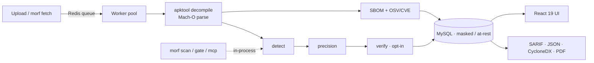

<!-- ────────────────────────  MORF · README  ──────────────────────── -->
<!-- Design system (ui-ux-pro-max): Exaggerated Minimalism · JetBrains Mono ·
     slate #1E293B + scan-blue #2563EB · high contrast · no purple/pink. -->

<div align="center">

<a href="https://github.com/amrudesh1/morf">
  
</a>

<br/>


### Every scanner reads your **source**. MORF reads the app you **ship** — and proves the secret is **live**.


<br/><br/>

[](#-quick-start)
&nbsp;
[](https://github.com/amrudesh1/morf/stargazers)
&nbsp;
[](https://www.blackhat.com/)

<br/>


</div>

<br/>

<div align="center">

`APK + IPA`&nbsp;&nbsp;•&nbsp;&nbsp;`280+ detectors`&nbsp;&nbsp;•&nbsp;&nbsp;`24 live verifiers`&nbsp;&nbsp;•&nbsp;&nbsp;`SBOM + CVE`&nbsp;&nbsp;•&nbsp;&nbsp;`SARIF / MASVS`&nbsp;&nbsp;•&nbsp;&nbsp;`0 false positives*`

</div>

---

## The game-changer, in one line

Source SAST and repo secret-scanners look at code that *might* ship. **MORF disassembles the
exact binary on the store** — Android `.apk` **and** iOS `.ipa` — finds the secrets, then
does what nothing else in OSS does at this layer: **calls the provider read-only to prove the
key is *active*.** A finding stops being *"this looks like a Stripe key"* and becomes
*"this key is **LIVE**, here's the MASVS control, and it's **new** since your last build."*

<div align="center">

|  | 🩶 &nbsp;Source / repo scanners | 🔵 &nbsp;**MORF** |
|---|:---:|:---:|
| Scans the **shipped artifact** (APK **&** IPA) | — | **✔** |
| **Verifies** the secret is live (read-only) | — | **✔** |
| **Deterministic** precision (no LLM, no network) | — | **✔** |
| Per-app **SBOM + CVE** (CycloneDX 1.6) | — | **✔** |
| Build **gate** on *new* secrets only | — | **✔** |
| **SARIF 2.1.0 + OWASP MASVS** native | partial | **✔** |

</div>

<br/>

<div align="center">

### ⛬ &nbsp;548 raw hits → **9 real secrets** → **0 false positives** &nbsp;⛬
*The precision engine, measured on the bundled benchmark corpus.*

</div>

---

## ✦ &nbsp;What you get

<table>
<tr>
<td width="50%" valign="top">

**◆ Dual-platform binary recon**
Android `.apk` (apktool → smali, resources, native `.so`, Flutter, assets, config) and iOS
`.ipa` (pure-Go Mach-O — Swift/Obj-C/C strings, frameworks, entitlements, URL schemes).

**◆ Deterministic precision engine**
Shannon entropy + structure tier every candidate `drop / info / keep`. No network, no model.
Hundreds of raw hits → a clean handful.

**◆ 280+ detectors, precision-gated**
One platform-scoped YAML core compiled to a single ripgrep pass — modern cloud / CI / SaaS /
AI token families.

**◆ 24 live verifiers (opt-in, read-only)**
GitHub · GitLab · Slack · Stripe · GCP · **AWS SigV4 STS** · OpenAI · Anthropic · Datadog ·
Square · Notion · Figma · … → `active / inactive / unknown`.

</td>
<td width="50%" valign="top">

**◆ SBOM + CVE, per scanned app**
Evidence-based **CycloneDX 1.6** (frameworks, dylibs, native libs, Firebase — PURL-mapped,
lockfile versions) with opt-in **OSV/CVE** into `vulnerabilities[]`.

**◆ MASVS findings — secrets *and* platform**
Exported components, deeplink hijack, Firebase/GCP misconfig — tagged
`MASVS-STORAGE / -CRYPTO / -NETWORK / -PLATFORM`.

**◆ CI-native gate**
`morf scan` / `morf gate`: policy exit codes, fail on **new** secrets vs a baseline. Recipes
for GitHub Actions, GitLab, Jenkins, CircleCI, pre-commit.

**◆ Three surfaces, one binary**
Scalable **service** (Redis queue + workers, MySQL, Prometheus/Grafana, OTel, K8s) · CI **CLI**
· **MCP** server for AI agents. React 19 web UI on top.

</td>
</tr>
</table>

---

## ▶ &nbsp;Quick Start

```bash
git clone https://github.com/amrudesh1/morf && cd morf
docker compose up -d --build            # MySQL + Redis + Go backend + React UI
#   Apple Silicon: docker compose -f docker-compose.yml -f docker-compose.local.yml up -d --build
```

<div align="center">

| ◐ Web UI | ◑ API | ◒ Health |
|:---:|:---:|:---:|
| `http://localhost/` | `http://localhost:9092/api` | `…/api/health` |

</div>

<details>
<summary><b>⌘ &nbsp;Run it in CI (the money shot)</b></summary>

```bash
# Emit SARIF, fail the build (exit 4) ONLY on a live-verified secret:
morf scan app.apk --sarif --out morf.sarif --fail-on=verified --verify

# Per-app SBOM with CVE correlation:
morf scan app.apk --format=cyclonedx-sbom --with-cve --out sbom.json

# Build-diff gate: fail only on NEW secrets vs an accepted baseline:
morf gate app.apk --baseline morf-baseline.json --fail-on=verified
```
```yaml
# GitHub Actions — scan → upload SARIF → gate, in one step:
- uses: amrudesh1/morf/.github/actions/morf-scan@main
  with: { artifact: app.apk, fail-on: verified, verify: "true" }
```
**Exit codes:** `0` pass · `4` policy hit · `1` operational error. All values masked.
</details>

<details>
<summary><b>⌘ &nbsp;Run locally without Docker</b></summary>

```bash
cd morf && go build -o morf .
../scripts/fetch-tools.sh          # one-time: fetch apktool.jar for local APK scans
./morf scan ../app.ipa --sarif     # iOS is pure-Go (needs only ripgrep)
```
</details>

---

## ⚙ &nbsp;How it works



A **Go 1.25** backend + **React 19 / Vite / Tailwind** UI. The same leaf packages
(`detect`, `precision`, `verify`, `report`, `gate`, `osv`) power the service, the CLI, and
the MCP server. → [docs/ARCHITECTURE.md](docs/ARCHITECTURE.md)

---

## ◈ &nbsp;Proof: the benchmark

Hermetic (ripgrep-only, no network), reproducible with **`morf benchmark`**:

<div align="center">

| Stage | Precision | Recall | F1 |
|:---|:---:|:---:|:---:|
| Raw candidates | `0.57 – 0.90` | `1.00` | — |
| **After precision engine** | **`1.00`** | **`1.00`** | **`1.00`** |

**16 planted secrets recalled · 0 false positives · 5 decoys dropped.**
<sub>* on the bundled labeled corpus — methodology & caveats in [docs/BENCHMARK.md](docs/BENCHMARK.md)</sub>

</div>

---

## ⛨ &nbsp;Safe against production artifacts

> **Verification is default-OFF** and read-only (AWS STS `GetCallerIdentity`, never a mutating call) · **masking everywhere**, fail-closed · **no plaintext at rest** (AES-256-GCM opt-in) · **fingerprint-only identity** (baselines are committable) · **fail-closed auth** · hardened CI (`go test -race`, gosec, govulncheck, Trivy). → [docs/SECURITY_ROADMAP.md](docs/SECURITY_ROADMAP.md)

<details>
<summary><b>MCP agent server &nbsp;·&nbsp; docs index</b></summary>

<br/>

`morf mcp` — stdio MCP server (no DB/Redis/HTTP, all outputs masked):
`scan_file` · `get_results` · `list_patterns` · `verify_secret` · `explain_finding`.

| Doc | | Doc | |
|---|---|---|---|
| [ARCHITECTURE](docs/ARCHITECTURE.md) | component map | [CI](docs/CI.md) | CLI + recipes |
| [MASVS](docs/MASVS.md) | control mapping | [BENCHMARK](docs/BENCHMARK.md) | precision/recall |
| [INGESTION](docs/INGESTION.md) | fetch adapters | [IOS_SCANNING](docs/IOS_SCANNING.md) | Mach-O internals |
</details>

---

<div align="center">

## ✦ &nbsp;Built by

| <br>[**@amrudesh1**](https://github.com/amrudesh1) | <br>[**@abhi-r3v0**](https://github.com/abhi-r3v0) | <br>[**@himanshudas**](https://github.com/himanshudas) |
|:---:|:---:|:---:|

<br/>

**If MORF caught a secret you'd have shipped — [⭐ star the repo](https://github.com/amrudesh1/morf/stargazers).**

Released under the **Apache License 2.0** · [LICENSE](LICENSE)
<br/><sub>Acknowledgments: [secrets-patterns-db](https://github.com/mazen160/secrets-patterns-db) · [go-macho](https://github.com/blacktop/go-macho) · [OSV.dev](https://osv.dev)</sub>


</div>
