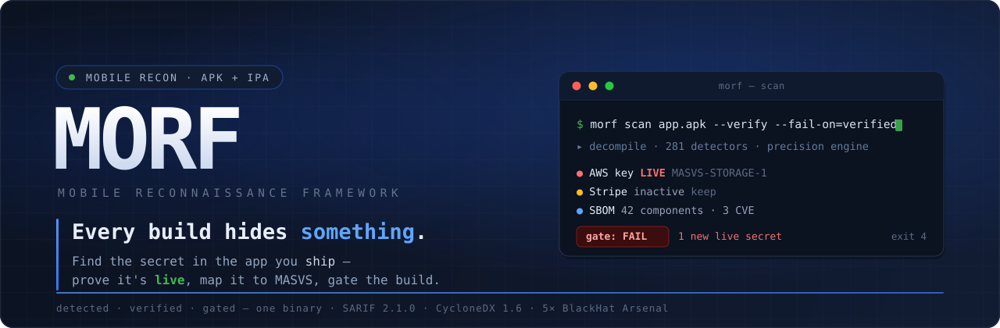
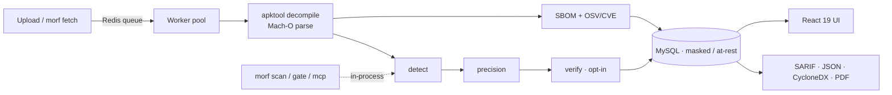

<!-- Design: ui-ux-pro-max · Exaggerated Minimalism · slate #1E293B + scan-blue #2563EB · JetBrains Mono · high contrast -->

<div align="center">



<br/>

**The only OSS scanner that reads the app you _ship_ — Android `.apk` **and** iOS `.ipa` — finds the secret, and _proves it's live_.**

<br/>

[](https://github.com/amrudesh1/morf/actions/workflows/ci.yml)
[](LICENSE)
[](morf/go.mod)
[](frontend/)
[](docs/MASVS.md)
[](docs/MASVS.md)
[](docs/BENCHMARK.md)
[](#-conference-recognition)

`APK + IPA`&nbsp;·&nbsp;`280+ detectors`&nbsp;·&nbsp;`24 live verifiers`&nbsp;·&nbsp;`SBOM + CVE`&nbsp;·&nbsp;`SARIF / MASVS`&nbsp;·&nbsp;`build gate`

[**Quick Start**](#-quick-start) &nbsp;•&nbsp; [**Installation**](#-installation) &nbsp;•&nbsp; [**Usage**](#-usage) &nbsp;•&nbsp; [**Docs**](#-documentation) &nbsp;•&nbsp; [⭐ **Star**](https://github.com/amrudesh1/morf/stargazers)

</div>

---

## 📋 Table of Contents

- [💡 Overview](#-overview) · [Why MORF](#why-morf)
- [🔍 Key Features](#-key-features)
- [🚀 Quick Start](#-quick-start)
- [📦 Installation](#-installation)
- [🖥️ Usage](#-usage) — [Web](#web-interface) · [CLI & CI](#command-line--ci) · [SBOM + CVE](#sbom--cve) · [MCP](#mcp-agent-server)
- [🎯 Detection & Precision](#-detection--precision)
- [🔴 Verification](#-verification-opt-in-read-only)
- [🛡️ SARIF & OWASP MASVS](#️-sarif--owasp-masvs)
- [🏗️ Architecture](#️-architecture)
- [⛨ Security Posture](#-security-posture) · [◈ Benchmark](#-benchmark)
- [📋 Common Use Cases](#-common-use-cases) · [🛣️ Roadmap](#️-roadmap)
- [📚 Documentation](#-documentation) · [🏆 Conference Recognition](#-conference-recognition)
- [👨‍💻 Authors](#-authors) · [📄 License](#-license) · [🙏 Acknowledgments](#-acknowledgments)

---

## 💡 Overview

**MORF — Mobile Reconnaissance Framework** is an offensive-security toolkit that discovers
hardcoded secrets and recon signal inside mobile application **artifacts** — Android `.apk`
and iOS `.ipa` — from a single shared detection core. Unlike source-level SAST or repo secret
scanners, MORF works on the **shipped binary**: it decompiles APKs with apktool and parses
Mach-O executables in pure Go, then runs the same secret patterns and precision engine over
both.

MORF runs three ways from **one binary**: a scalable **service** (Redis-backed job queue +
worker pool, MySQL, Prometheus/Grafana, OpenTelemetry, React 19 web UI), a CI-native **CLI**,
and an **MCP server** for LLM agents.

### Why MORF

Source SAST and repo secret-scanners read code that *might* ship. **MORF disassembles the
exact binary on the store** and answers what a plain regex scanner can't:

<div align="center">

|  | Source / repo scanners | **MORF** |
|---|:---:|:---:|
| Scans the **shipped artifact** (APK **&** IPA) | — | **✔** |
| **Verifies** the secret is live (read-only) | — | **✔** |
| **Deterministic** precision (no LLM, no network) | — | **✔** |
| Per-app **SBOM + CVE** (CycloneDX 1.6) | — | **✔** |
| Build **gate** on *new* secrets only | — | **✔** |
| **SARIF 2.1.0 + OWASP MASVS** native | partial | **✔** |

**548 raw hits → 9 real secrets → 0 false positives** &nbsp;·&nbsp; *the precision engine, on the bundled benchmark corpus.*

</div>

---

## 🔍 Key Features

| Feature | Description |
|---|---|
| **🔐 Secret & API-key detection** | 280+ platform-scoped patterns compiled to a single ripgrep pass over smali, resources, native `.so`, Flutter/RN bundles, `assets/`, `resources.arsc`, embedded config, and Mach-O strings. |
| **✅ Live verification** | **24** read-only provider verifiers confirm a candidate is `active` / `inactive` / `unknown` — GitHub, GitLab, Slack, Stripe, GCP, **AWS SigV4 STS**, OpenAI, Anthropic, Datadog, Square, Notion, Figma, … Default **OFF**. |
| **🎯 Precision engine** | Shannon entropy + structural validators tier every candidate `drop` / `info` / `keep` with a `[0,1]` score. Deterministic, no network, no model. |
| **🧾 SBOM + CVE** | Evidence-based **CycloneDX 1.6** per scanned app (frameworks, dylibs, native libs, Firebase — PURL-mapped, lockfile versions), with opt-in **OSV/CVE** correlation into `vulnerabilities[]`. |
| **📱 Component & permission analysis** | Extracts activities/services/receivers/providers, permissions, deeplinks & URL schemes, entitlements, and app metadata — with MASVS-mapped **exported-component / deeplink exposure** and **Firebase/GCP misconfig** findings. |
| **🚦 CI gate** | `morf scan` / `morf gate`: policy exit codes, fail on **new** secrets vs an accepted baseline. Recipes for GitHub Actions, GitLab, Jenkins, CircleCI, pre-commit. |
| **🛡️ SARIF 2.1.0 + OWASP MASVS** | Schema-valid SARIF for GitHub Code Scanning; findings carry `MASVS-STORAGE / -CRYPTO / -NETWORK / -PLATFORM` ids; secret values masked. |
| **🤖 MCP agent server** | `morf mcp` exposes `scan_file`, `get_results`, `list_patterns`, `verify_secret`, `explain_finding` over stdio — all outputs masked, no DB/Redis/HTTP. |
| **📊 Version comparison** | `/compare` diffs two scans (added / removed / unchanged) to track secret hygiene across builds. |
| **⚙️ Scalable service** | Redis reliable queue (DLQ + reaper) + worker pool, normalized MySQL (GORM), API-key auth + rate limiting, Prometheus/Grafana, OpenTelemetry, S3/local storage, K8s/KEDA. |
| **🖥️ React 19 web UI** | Vite + Tailwind "Electric Slate" UI: drag-and-drop upload, live scan stepper, findings by tier/platform, `/compare`, PDF export. |
| **🔐 At-rest protection** | Values masked by default; optional AES-256-GCM at rest; stable identity via keyed-HMAC **fingerprint** (never plaintext). |

---

## 🚀 Quick Start

MORF runs as a Docker Compose stack — **MySQL + Redis + Go backend + React frontend**:

```bash
git clone https://github.com/amrudesh1/morf && cd morf

# Option 1 — run script (recommended):
./run-local.sh start

# Option 2 — Docker Compose directly:
docker compose up -d --build
#   Apple Silicon (arm64): the backend must build native arm64 —
docker compose -f docker-compose.yml -f docker-compose.local.yml up -d --build
```

<div align="center">

| ◐ Web UI | ◑ API | ◒ Health |
|:---:|:---:|:---:|
| `http://localhost/` | `http://localhost:9092/api` | `…/api/health` |

</div>

---

## 📦 Installation

### Prerequisites

- **Docker + Docker Compose** (recommended path), **or** for a local build:
  **Go 1.25**, **Node 20+**, **ripgrep**, **Java 11+** (APK decompile only), plus **Redis** & **MySQL**.

### Method 1 — Docker (recommended)

```bash
git clone https://github.com/amrudesh1/morf && cd morf
docker compose up -d --build          # MySQL · Redis · backend · frontend
docker compose logs -f morf-backend   # follow logs
docker compose down                   # stop
```

### Method 2 — Run script

```bash
./run-local.sh start | status | logs | stop
```

### Environment configuration

Copy the example env and override credentials for any real deployment (a local-dev fallback
is baked into `docker-compose.yml`, so `docker compose up` works with no `.env`):

```bash
cp .env.example .env            # macOS / Linux
copy .env.example .env          # Windows (CMD)
Copy-Item .env.example .env     # Windows (PowerShell)
```

Key vars: `DATABASE_URL`, `REDIS_URL`, `MORF_REQUIRE_API_KEY` (default **true**),
`MORF_MASK_RESULTS` (default **true**), `MORF_ENABLE_VERIFICATION` (default **off**),
`MORF_SECRET_ENCRYPTION_KEY`, `MORF_FINGERPRINT_SALT`, `MORF_ENABLE_OSV`, `MORF_WEBHOOK_SECRET`.

### Local (no Docker)

```bash
cd morf && go build -o morf .
../scripts/fetch-tools.sh       # one-time: fetch apktool.jar for local APK scans
./morf scan ../app.ipa --sarif  # iOS path is pure-Go (needs only ripgrep)
```

---

## 🖥️ Usage

### Web Interface

Open `http://localhost/`, drag an `.apk`/`.ipa` onto the intake screen, and watch the live
scan stepper. Findings are grouped by **tier** (`keep`/`info`) and **platform**; the
**Detection rules** view manages patterns at runtime, and `/compare` diffs two scans. Export
to **SARIF / JSON / CSV / PDF / CycloneDX**. *Everything is analyzed on your machine — nothing
about the app leaves your setup.*

### Command line & CI

The same scan → precision → verify pipeline the worker runs, built for CI.
[docs/CI.md](docs/CI.md) is the canonical contract + reusable recipes.

```bash
# Emit SARIF, fail the build (exit 4) ONLY on a live-verified secret:
morf scan app.apk --sarif --out morf.sarif --fail-on=verified --verify

# Report-only JSON, never fail the build:
morf scan app.ipa --format=json --fail-on=none

# Build-diff gate: fail only on NEW secrets vs an accepted baseline of fingerprints:
morf gate app.apk --baseline morf-baseline.json --fail-on=verified
morf gate app.apk --baseline morf-baseline.json --update-baseline   # accept current state
```

**Exit codes:** `0` pass · `4` policy hit (CI gates on this) · `1` operational error.
**`--fail-on`:** `verified` · `keep` · `any` · `none`. All SARIF/JSON values are masked.

```yaml
# GitHub Actions — scan → upload SARIF → gate, in one step:
- uses: amrudesh1/morf/.github/actions/morf-scan@main
  with: { artifact: app.apk, fail-on: verified, verify: "true" }
```

### SBOM + CVE

```bash
morf scan app.apk --format=cyclonedx-sbom --out sbom.json           # evidence-based SBOM
morf scan app.apk --format=cyclonedx-sbom --with-cve --out sbom.json # + OSV/CVE correlation
```

### MCP agent server

```bash
morf mcp    # stdio MCP server — no DB/Redis/HTTP, every output masked
```
Tools: `scan_file` · `get_results` · `list_patterns` · `verify_secret` · `explain_finding`.

---

## 🎯 Detection & Precision

One shared **detection core** (`detect/`) compiles 280+ platform-scoped YAML patterns into a
single ripgrep pass over both platforms — including native `.so`, Flutter/RN bundles,
`assets/`, `resources.arsc`, and embedded config (`google-services.json`,
`GoogleService-Info.plist`). Every candidate then flows through the **precision engine**:
entropy + structural validators assign a tier (`drop`/`info`/`keep`) — **deterministic, no
network, no model** — so breadth never reintroduces noise. Add a detector with a YAML entry or
the `/api/patterns` CRUD — no code change.

## 🔴 Verification (opt-in, read-only)

Confirm a candidate is *live* against its provider — **default OFF**, gated behind `--verify` /
`MORF_ENABLE_VERIFICATION=true`, always read-only (rate-limited, no redirects, result-cached,
raw secret never logged). **24 verifiers** incl. GitHub · GitLab · Slack · Stripe · GCP ·
**AWS SigV4 STS** · OpenAI · Anthropic · Datadog · PagerDuty · Square · Heroku · Figma ·
Notion · Airtable · Mapbox · Twilio · SendGrid · Cloudflare → `active`/`inactive`/`unknown`.

## 🧾 SBOM + CVE

Evidence-based **CycloneDX 1.6** SBOM of each scanned artifact — iOS frameworks/dylibs (resolved
versions), Android native libs (SHA-256), Firebase — each component carrying
`evidence.identity` + confidence and a spec-correct **PURL** (`pkg:cocoapods` / `pkg:swift` /
`pkg:maven` / `pkg:pub` / `pkg:npm`). Lockfiles in the tree (`Podfile.lock`,
`Package.resolved`, `pubspec.lock`, `package-lock.json`) refine versions. With `--with-cve`,
component PURLs are correlated against **OSV** into the CycloneDX `vulnerabilities[]` array.

## 🛡️ SARIF & OWASP MASVS

Schema-valid **SARIF 2.1.0** (`report/sarif.go`): tier → level (`keep`=error, `info`=note),
every secret masked. Findings — secret **and** platform (exported components, deeplinks,
Firebase/GCP misconfig) — carry an OWASP **MASVS** control id
(`MASVS-STORAGE-1/-2`, `-CRYPTO-1`, `-NETWORK-1`, `-PLATFORM-1`) in the rule `tags` and a
`masvsId` property. See [docs/MASVS.md](docs/MASVS.md).

---

## 🏗️ Architecture



A **Go 1.25** backend + **React 19 / Vite / Tailwind** UI. The same leaf packages
(`detect`, `precision`, `verify`, `report`, `gate`, `osv`) power the service, the CLI, and the
MCP server. → [docs/ARCHITECTURE.md](docs/ARCHITECTURE.md)

## ⛨ Security Posture

> **Verification default-OFF** & read-only (AWS STS `GetCallerIdentity`, never a mutating call);
> OSV correlation opt-in too · **masking everywhere**, fail-closed · **no plaintext at rest**
> (AES-256-GCM opt-in) · **fingerprint-only identity** (baselines are committable) ·
> **fail-closed auth** · hardened CI (`go test -race`, gosec, govulncheck, Trivy).
> → [docs/SECURITY_ROADMAP.md](docs/SECURITY_ROADMAP.md)

## ◈ Benchmark

Hermetic (ripgrep-only, no network), reproducible with **`morf benchmark`**:

<div align="center">

| Stage | Precision | Recall | F1 |
|:---|:---:|:---:|:---:|
| Raw candidates | `0.57 – 0.90` | `1.00` | — |
| **After precision engine** | **`1.00`** | **`1.00`** | **`1.00`** |

**16 planted secrets recalled · 0 false positives · 5 decoys dropped.** <sub>[docs/BENCHMARK.md](docs/BENCHMARK.md)</sub>

</div>

---

## 📋 Common Use Cases

| Use Case | Description |
|---|---|
| **🕵️ Pre-release artifact audits** | Scan the exact `.apk`/`.ipa` you ship, not the source tree. |
| **⚙️ CI/CD secret gate** | `morf gate` fails a build only on new secrets vs an accepted baseline. |
| **🛡️ GitHub Code Scanning** | Upload MORF SARIF to the Security tab; findings carry MASVS ids. |
| **🧾 Supply-chain / SBOM** | Emit a per-app CycloneDX SBOM with CVE correlation for compliance. |
| **🤖 Agent-driven triage** | Point an LLM agent at `morf mcp` to scan, verify, and explain findings. |
| **🔍 Competitive / research recon** | Understand secret hygiene and structure of any shipped app. |

## 🛣️ Roadmap

- [x] Dual APK + IPA recon · precision engine · SARIF/MASVS · CLI + gate
- [x] Live verification (24 providers) · at-rest crypto · MCP server
- [x] Per-app SBOM (CycloneDX 1.6) + OSV/CVE correlation
- [x] MASVS-PLATFORM findings (exported components, deeplinks, Firebase/GCP misconfig)
- [ ] Detector breadth toward TruffleHog-scale, behind the precision guard
- [ ] More provider verifiers (Azure, JWT signature, Firebase service-account)
- [ ] DEX/smali class-fingerprinting for Android library identification (LibScout-style)
- [ ] Native vendor ingestion (App Store Connect / TestFlight / Play)

---

## 📚 Documentation

| Doc | | Doc | |
|---|---|---|---|
| [ARCHITECTURE](docs/ARCHITECTURE.md) | component map & data flow | [CI](docs/CI.md) | CLI contract + recipes |
| [MASVS](docs/MASVS.md) | control mapping | [BENCHMARK](docs/BENCHMARK.md) | precision/recall method |
| [INGESTION](docs/INGESTION.md) | artifact fetch adapters | [IOS_SCANNING](docs/IOS_SCANNING.md) | pure-Go Mach-O internals |
| [SECURITY_ROADMAP](docs/SECURITY_ROADMAP.md) | threat model & roadmap | | |

## 🏆 Conference Recognition

**BlackHat Arsenal 2026** — MORF returns with its v2 posture: dual APK+IPA binary recon,
*verified* secrets, per-app SBOM+CVE, and SARIF/MASVS CI output.

<details>
<summary>Previous appearances</summary>

- **BlackHat Asia 2023** — Arsenal debut
- **BlackHat US 2023** — Arsenal
- **BlackHat Europe 2024** — Arsenal
- **BlackHat Asia 2025** — Arsenal

</details>

---

<div align="center">

## 👨‍💻 Authors

| <br>[**@amrudesh1**](https://github.com/amrudesh1) | <br>[**@abhi-r3v0**](https://github.com/abhi-r3v0) | <br>[**@himanshudas**](https://github.com/himanshudas) |
|:---:|:---:|:---:|

<br/>

**If MORF caught a secret you'd have shipped — [⭐ star the repo](https://github.com/amrudesh1/morf/stargazers).**

## 📄 License

Released under the **Apache License 2.0** — see [LICENSE](LICENSE).

## 🙏 Acknowledgments

[secrets-patterns-db](https://github.com/mazen160/secrets-patterns-db) · [go-macho](https://github.com/blacktop/go-macho) · [OSV.dev](https://osv.dev)


</div>
