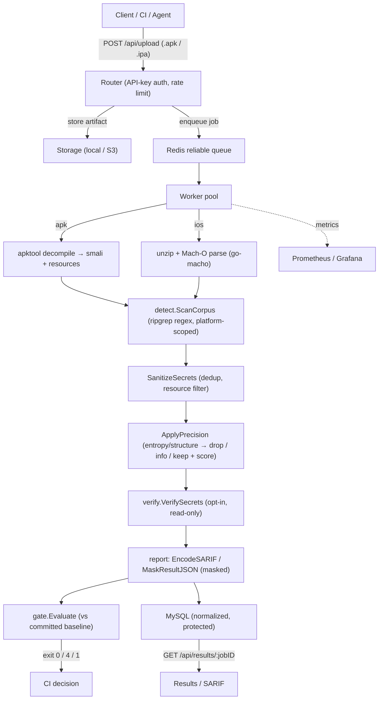
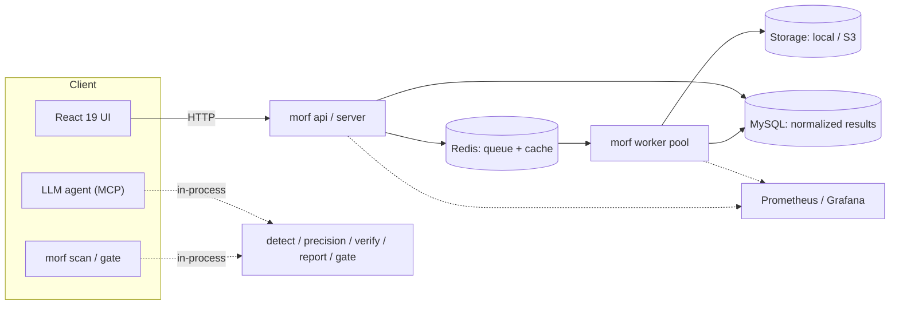

# MORF Architecture

**MORF - Mobile Reconnaissance Framework** is a **Go 1.25 backend** (module `morf`) with a
**React 19 + Vite + Tailwind** frontend (`frontend/`). The backend is a scalable service,
but the security-critical logic lives in small **leaf packages** (`detect`, `precision`,
`verify`, `report`, `gate`, `crypto`) that the service, the CLI, and the MCP server all
share. That is the core design idea: **one detection pipeline, three entrypoints.**

- **Service** — `morf server` / `morf api` / `morf worker`: HTTP API + Redis queue +
  worker pool + MySQL, driven by the React UI.
- **CLI** — `morf scan` / `morf gate`: runs the same pipeline in-process for CI (no
  DB/Redis needed). See [CI.md](CI.md).
- **MCP** — `morf mcp`: a stdio MCP server for LLM agents, also in-process.

## Component map

| Layer | Packages | Responsibility |
|---|---|---|
| Ingest / parse | `apk/` (apktool + ripgrep; manifest, components, metadata), `ios/` (pure-Go Mach-O via `go-macho`, `Info.plist`, FairPlay `cryptid` detection, frameworks, entitlements) | Turn an `.apk`/`.ipa` into a scannable corpus. |
| Detection core | `detect/` — `detect.go` (YAML → combined ripgrep regex, platform scoping, MASVS resolution), `precision.go` (entropy/structure tiering → `drop`/`info`/`keep` + score) | Shared, platform-agnostic secret detection + noise reduction. |
| Verification | `verify/` — default-OFF (`MORF_ENABLE_VERIFICATION`), read-only checks; 11 providers (github, gitlab, slack, stripe, google/gcp, twilio, sendgrid, npm, cloudflare, mailgun, digitalocean) + AWS SigV4 STS pairing | Confirm a candidate is `active` / `inactive` / `unknown` / `unchecked`. |
| Reporting | `report/sarif.go` — SARIF 2.1.0 (`EncodeSARIF`), tier→level, MASVS id in rule `tags` + `masvsId`; `MaskResultJSON` (fail-closed) | CI / Code-Scanning-ready output, always masked. |
| Gate | `gate/gate.go` — build-diff gate on `crypto.Fingerprint`; policies `new_verified` / `new_any` / `new_tier_keep` / `none`; committable JSON baseline | Fail a build only on *new* secrets. |
| Crypto | `crypto/secretcrypto.go` — keyed-HMAC `Fingerprint` + AES-256-GCM at-rest | Stable identity + storage safety, never plaintext. |
| CLI | `cmd/` — `scan.go`, `gate.go`, `mcp.go`, `cli.go`, `apikey.go`, `root.go` | CI-friendly command surface (exit `0/4/1`). |
| MCP | `mcp/server.go` — stdio server, tools `scan_file` / `list_patterns` / `verify_secret` / `explain_finding` | LLM-agent entrypoint. |
| Service | `queue/` (Redis reliable queue, DLQ, reaper), `worker/` (pool), `storage/` (local + S3 + SigV4), `router/` (routes, rate-limit, middleware), `db/` (normalized MySQL/GORM, migrations 001–010), `auth/`, `metrics/`, `k8s/`, `grafana/`, `prometheus/`, `config/`, `version/` | The scalable async service. |

## Scan data flow

The service path wraps the shared pipeline behind an async queue; the CLI/MCP path runs the
same leaf packages directly.

Pipeline in words: `artifact → (apk: apktool decompile | ios: unzip + Mach-O parse) →
detect.ScanCorpus → SanitizeSecrets → ApplyPrecision → verify.VerifySecrets (opt-in) →
report.EncodeSARIF / MaskResultJSON → gate.Evaluate`. The CLI and MCP entrypoints call the
same `detect → precision → verify → report/gate` chain with no service dependencies.

## Service topology

The service scales the API and workers independently (`morf api` + `morf worker`), and the
K8s/KEDA manifests autoscale the worker pool on queue depth. Migrations run once via
`morf migrate` (as a K8s init job), not on every server boot.

## Cross-references

- Job queue design: [`../morf/docs/job-queue-design.md`](../morf/docs/job-queue-design.md)
- Database schema: [`../morf/docs/schema-design.md`](../morf/docs/schema-design.md)
- iOS scanning internals: [`../morf/docs/IOS_SCANNING.md`](../morf/docs/IOS_SCANNING.md)
- HTTP API: [`../morf/docs/api/openapi.yaml`](../morf/docs/api/openapi.yaml)
- CLI / CI contract: [CI.md](CI.md)
- MASVS mapping: [MASVS.md](MASVS.md)
- Security assessment + roadmap: [SECURITY_ROADMAP.md](SECURITY_ROADMAP.md)
